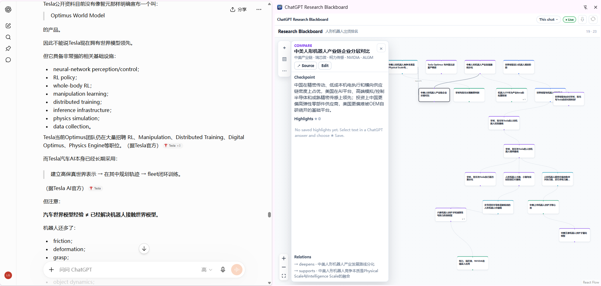

# ChatGPT Research Blackboard

**简体中文** | [English](./README_EN.md)

## 把越聊越长的 ChatGPT，对话变成一张会自己整理的研究地图

如果你经常用 ChatGPT 研究一个复杂问题，大概会遇到这种情况：

- 聊了几十轮以后，已经忘了前面得出过什么结论；
- 一个问题越挖越深，又横向跑出好几个分支；
- 想回到某个旧话题，只能疯狂往上翻；
- 明明讨论过很多东西，但最后脑子里只剩一条很长的聊天记录。

**ChatGPT Research Blackboard** 就是为这个问题做的。

它会在 ChatGPT 旁边自动维护一张“研究黑板”：把你的分析、比较、问题、综合和判断整理成图。你仍然像平时一样聊天，不需要手动画脑图，也不需要学习一套新的笔记方法。



> 当前推荐版本：**v0.1.1 Pre-release**。面向桌面 Chrome / Chromium 与 `chatgpt.com`。

## 你会得到什么

### 1. 长对话不再只是一条时间线

普通 ChatGPT 记录告诉你“先说了什么、后说了什么”。Research Blackboard 更关心：

```text
这个问题是什么
    ↓
我们往哪里深挖了
    ↓
和什么做过比较
    ↓
哪些结论支持 / 冲突
    ↓
最后形成了什么判断
```

所以你看到的不是聊天记录复制品，而是**这场研究本身的结构**。

### 2. 图会跟着对话自动长出来

打开 Side Panel 后，你正常问问题即可。

Research Blackboard 会根据对话自动新增、更新和连接节点。大部分时候你不需要整理；只有觉得结构不对时，再手工纠正一下。

这也是这个项目最重要的原则：

> **让 AI 负责整理，让人负责思考。**

### 3. 一眼回到原始上下文

看到图上的某个节点，想知道“当时到底是怎么说的”？

- **双击 Node**：回到对应的原始 ChatGPT 消息；
- **Highlight → Source**：回到你保存的那句原文，并临时高亮；
- 不需要在几十屏聊天记录里重新找。

### 4. 把真正重要的句子钉在研究节点上

在 ChatGPT 回答里选中文字，可以直接：

- `★ Save`：保存成 Highlight；
- `+ Node`：把这段内容直接提升成新的研究节点。

Highlight 还支持 Note、排序、移动、删除，以及 Promote / Demote。

### 5. 研究结果可以带走

支持导出：

- `.rbb.json`：完整备份，可重新导入；
- Markdown：适合整理成普通笔记；
- JSON Canvas：可继续放进 Obsidian 等工具；
- PNG：直接保存整张研究图。

## 适合什么场景

它特别适合那些**不会在一次问答里结束**的事情，例如：

- 学一个新领域；
- 做公司 / 行业研究；
- 比较多个方案；
- 做论文、技术或产品调研；
- 长期追踪一个复杂主题；
- 和 ChatGPT 连续讨论几十轮以后，还希望自己知道“我们研究到哪了”。

如果你只是偶尔问一句天气、翻译一句话，它基本没必要。

## 3 分钟安装

目前还没有上架 Chrome Web Store，需要手动安装一次。

1. 打开 [Releases](https://github.com/Gonglz/chatgpt-research-blackboard/releases)。
2. 下载最新版本：`chatgpt-research-blackboard-v0.1.1.zip`。
3. 解压 ZIP。
4. 在 Chrome 地址栏打开 `chrome://extensions/`。
5. 打开右上角 **开发者模式 / Developer mode**。
6. 点击 **加载已解压的扩展程序 / Load unpacked**。
7. 选择刚刚解压的文件夹。
8. 打开 ChatGPT，并打开 Research Blackboard Side Panel。

之后就可以像平时一样聊天。

> **不要安装旧的 v0.1.0。** v0.1.1 已移除早期版本从上游继承的 ChatGPT Token Capture / 私有 API compatibility 路径。

## 日常怎么用

最简单的工作流只有四步：

```text
打开一个 ChatGPT 对话
        ↓
打开 Research Blackboard
        ↓
继续正常聊天
        ↓
需要时看图、存 Highlight、双击回原文
```

Side Panel 中显示 `● Live` 时，自动建图正在工作。

你不需要输入“创建节点”“连接 A 和 B”之类的命令。

## 它不是另一个笔记软件

Research Blackboard 不想让你多维护一套知识库。

它更像 ChatGPT 旁边的一块**外部工作记忆**：

- ChatGPT 负责当前这一轮推理；
- Blackboard 负责记住长期结构；
- 你负责决定接下来值得研究什么。

因此它追求的不是“把所有内容都保存下来”，而是：

> **在不丢掉研究脉络的前提下，降低长对话的认知负担。**

## 隐私与安全

v0.1.1 做了一次专门的安全清理。

当前版本：

- **不会捕获或保存 ChatGPT Bearer Access Token**；
- **不会为了 API 访问读取 ChatGPT 登录 Cookie**；
- **不会调用 ChatGPT 私有 `/backend-api/` Conversation API**；
- Research Graph、Highlights、Project metadata 等主要保存在浏览器本地；
- 本项目没有自建用于收集 Research Blackboard 内容的云端服务器；
- 网站访问范围只限 `chatgpt.com` 和旧域名 `chat.openai.com`。

当前扩展权限：

```text
storage
sidePanel
scripting
```

其中 `scripting` 用于你主动触发的 Source Jump / Highlight 原文定位与临时高亮。

需要注意：当 Research Mode 开启时，扩展会把一段紧凑的 Research Blackboard 上下文随正常 ChatGPT 消息一起发送给 ChatGPT / OpenAI，用于维护语义图。

详细说明见 [PRIVACY_ZH.md](./PRIVACY_ZH.md) / [PRIVACY.md](./PRIVACY.md)。

## 当前版本的边界

这是一个 **Pre-release MVP**，目前有几个明确限制：

- **跨 Chat Source Jump 还不稳定**，暂时不要把它当成核心能力；
- 当前 Conversation snapshot 使用 DOM-only 方式，只能读取 ChatGPT 页面已经渲染出来的内容；
- 隐藏的 alternative branch 不会再通过私有 API 读取；
- 超长 Chat 如果被 ChatGPT 做了 virtualization / lazy rendering，未渲染历史可能不会进入本次 snapshot；
- ChatGPT 页面 DOM 一旦大改，Source Jump / parsing 可能需要跟着维护。

这些限制主要来自一个明确取舍：**宁愿少读一点隐藏数据，也不再依赖捕获账号凭据或私有 API。**

## 从源码运行

如果你是开发者：

```bash
git clone https://github.com/Gonglz/chatgpt-research-blackboard.git
cd chatgpt-research-blackboard
npm ci
npm test
npm run build
```

然后在 `chrome://extensions/` 中加载**仓库根目录**，不要加载 `dist/`。

<details>
<summary><strong>技术细节：Research Blackboard 是怎么工作的？</strong></summary>

### 语义节点

Research Blackboard 目前使用这些节点类型：

- Analysis
- Comparison
- Question
- Synthesis
- Judgment

关系包括：

- `deepens`
- `compares`
- `supports`
- `contradicts`
- `informs`

只有 `deepens` 决定纵向 Backbone。

Canonical 语义方向：

```text
更具体 child --deepens--> 更宽泛 parent
```

视觉上反过来阅读：

```text
更宽泛 parent
       ↓
更具体 child
```

### 自动建图

Side Panel 打开时，content script 会给用户消息附加紧凑的隐藏 Research Blackboard 请求（`RBREQ`）。

当这一轮发生有意义的结构变化时，ChatGPT 可以返回机器可读的 `RGΔ`。扩展会把这段结构信息从页面视觉上隐藏，并在本地更新图谱。

Context retrieval 优先级大致是：

1. 用户当前问题里的明确旧主题；
2. 与这个主题最相关的 Node / Edge；
3. 当前内部 context focus；
4. recency 只作为较弱的 tie-breaker。

### Layout

主要使用 ELK Layered：

- `deepens` 形成纵向 Backbone；
- cross-link 不决定 rank；
- 支持 soft drag preference；
- 自动处理同层碰撞与结构布局。

</details>

<details>
<summary><strong>开发 / Tests / CI</strong></summary>

```bash
npm ci
npm test
npm run build
```

回归测试覆盖：

- RGΔ parser / reducer；
- Synthesis / Judgment；
- `deepens` canonical 方向；
- Backbone parent / depth；
- cycle handling；
- vertical rank；
- 同层 Node 防重叠；
- privacy boundary；
- Source Jump / exact Highlight 对 `scripting` 的依赖。

GitHub Actions 执行：

```text
npm ci
→ npm test
→ npm run build
```

当前 release candidate 的 `npm audit --omit=dev` 为 0 production vulnerabilities。开发工具链仍有 esbuild advisory，因此没有强制做 breaking upgrade。

</details>

<details>
<summary><strong>架构</strong></summary>

```text
chatgpt.com
   ↓
content scripts
├─ research-runtime (DOM-only conversation bootstrap)
├─ research-producer (RBREQ v7)
└─ research-selection
   ↓
Chrome local storage / DOM-derived compatibility cache
   ↓
Research Blackboard side panel
├─ semantic graph reducer
├─ project / provenance scope
├─ ELK structural layout
├─ Highlight manager
├─ source jump
└─ export / import
```

核心 workflow 不需要额外 OpenAI API key、外部 RAG 服务或项目自建云服务。

</details>

## Fork、上游与许可证

本仓库是 [`Robbings/chatgpt-graph-navigator`](https://github.com/Robbings/chatgpt-graph-navigator) 的 fork 和衍生项目。

Research Blackboard 复用了部分上游 Chrome 扩展基础设施、ChatGPT DOM 观察、conversation cache 和消息锚定能力，并重构了主要产品模型、自动语义图、Highlight、Project、ELK Backbone 与 Side Panel UX。

本项目与 OpenAI 无隶属、背书或赞助关系。

上游仓库目前存在许可证元数据不一致：README 写 GPL-3.0，`package.json` 写 MIT，而当前检查到的上游根目录没有 `LICENSE` 文件。本 fork 不擅自替上游代码重新选择许可证。

重新分发或发布打包版本前，请阅读：

- [NOTICE.md](./NOTICE.md)
- [LICENSE_STATUS.md](./LICENSE_STATUS.md)

## Contributing

欢迎 PR。

如果修改自动建图、Backbone、Highlight provenance、Source Jump 等核心行为，请尽量同时补回归测试。

最重要的产品约束仍然是：

> **不要让“整理图谱”本身变成新的负担。**
